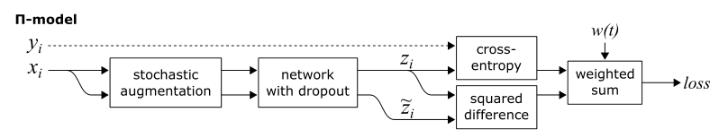
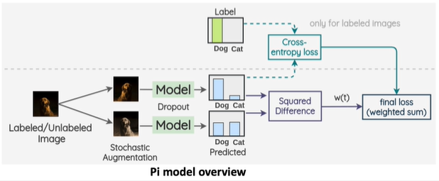
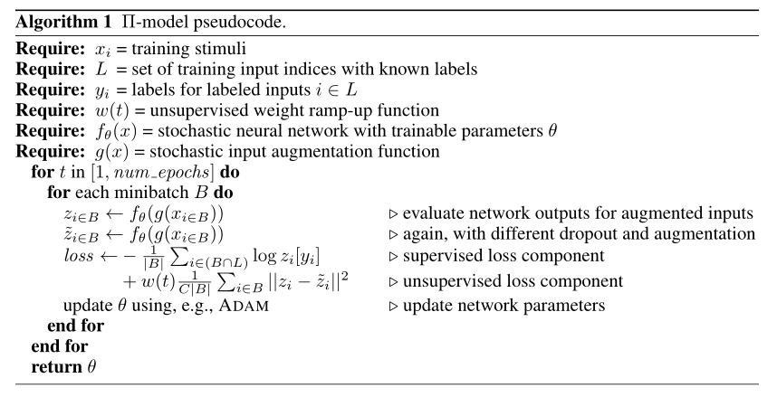
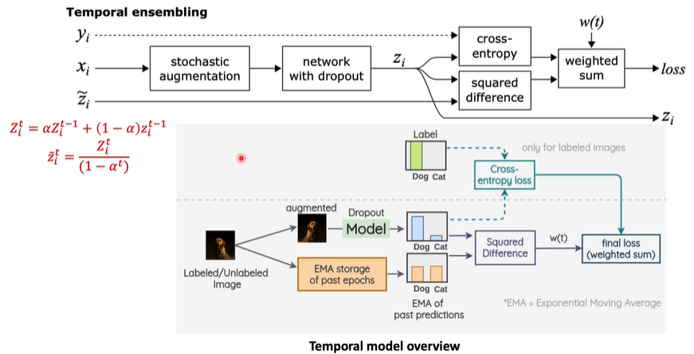
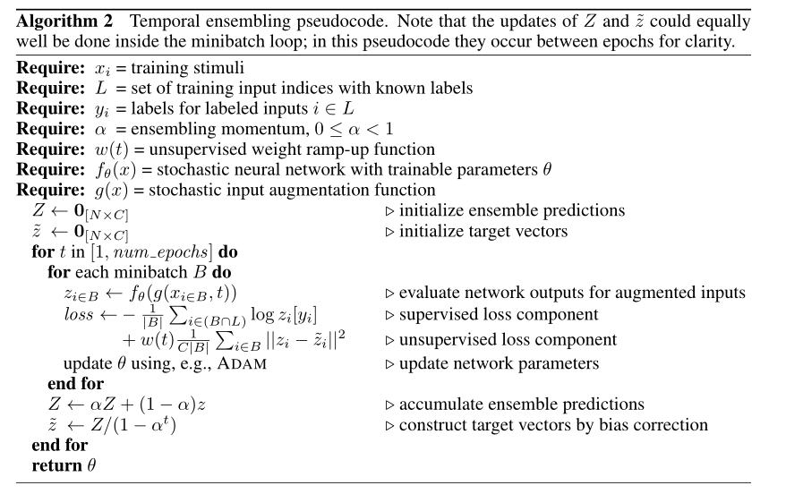
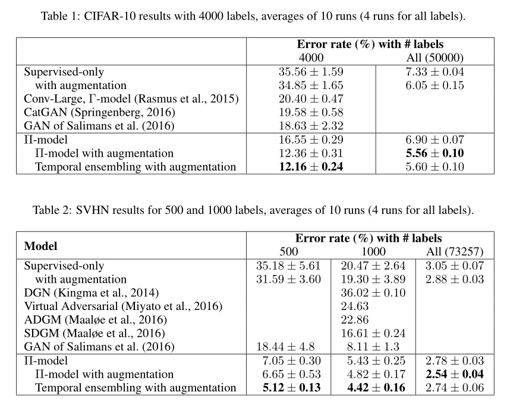

# 2017-Temporal-Ensembling  ICLR

> 论文题目：Temporal Ensembling for Semi-Supervised Learning
>
> 论文链接：[https://arxiv.org/abs/1610.02242](https://arxiv.org/abs/1610.02242)
>
> 论文代码：[https://github.com/s-laine/tempens](https://github.com/s-laine/tempens)
>
> 发表时间：2016年10月
>
> 论文引用：Laine S, Aila T. Temporal ensembling for semi-supervised learning[J]. arXiv preprint arXiv:1610.02242, 2016.
>
> 论文引用BiTex:
>
> ```bash
> @article{laine2016temporal,
>   title={Temporal ensembling for semi-supervised learning},
>   author={Laine, Samuli and Aila, Timo},
>   journal={arXiv preprint arXiv:1610.02242},
>   year={2016}
> }
> ```
> 引用数：1796


## 1. 简介

这篇文章是ICLR2017的一篇文章，是半监督学习领域的一篇经典文章，以这篇文章作为进入半监督学习的一个切入点。

在这篇文章中，作者的将其工作描述为self-ensembling，而具体来讲有两点：1. Π model 2. temporal ensembling。


## 2. 网络

### 2.1 Π model

Π model的思路来源比较直接，就是我们如何去使用无标签数据来进行模型训练。思考这个问题，先从有标签数据是如何学习来看，对于有标签数据的使用过程是这样的：

1. 我们已经获得了数据的标签
2. 我们可以轻易的通过网络的预测值和标签值构造一个损失函数，通常为交叉熵损失函数或者最小平方误差损失函数。
3. 通过迭代训练不断的使该函数趋于一个更小的值。

无标签数据之所以难以利用，是因为按照我们上述传统的思路，第一点没有，就无法进行第二步，从而无法进行第三步。

**但上述三步中，第三步是目的，第二部是关键，而第一步没有就没有，前提是我们第二部构造的损失函数，可以不借鉴标签值。**

因此学者提出了一个一致性约束假设：

> 对于无标签数据，模型或数据加一定扰动，预测结果一致

而这个约束就可以抽象为一个loss函数
$$
min(f(x)-f^*(x^*))
$$
注：*代表数据或者模型经过扰动

可以看到这个损失函数是没有涉及到标签值，它只是要求我们预测两次，并前后两次分别做了数据扰动和模型扰动。这个思想很直观，而Πmodel正是这个思想的实现。





具体流程如下：

* 第一步: 遍历每个输入（标记和未标记的输入混合在一起）。对于每个输入，我们计算该图像的两个随机增强。将这两个**增强图像输入到我们的卷积神经网络中**，该网络产生两个输出向量。

* 第二步：π-model 的核心思想是，为了规范模型并使其对噪声有弹性，我们应该惩罚它对同一图像的增强给出不同的预测。因此，除了通常用于此类图像分类任务的标准交叉熵损失（只为标记数据计算）外，我们还根据两个输出向量之间的平方差在损失中添加了一个被称为样本的“一致性损失”的损失项。

  数据点的最终损失是`交叉熵损失（如果数据点被标记）`和`一致性损失的加权和`。

  **权重 w(t)** 决定了一致性损失相对于交叉熵损失的权重。在第一个 epoch 期间，w(t) = 0，因为我们没有来自之前 epoch 的数据可以用来对未标记的点进行有意义的分类。随着模型的进展，w(t) 遵循高斯曲线增加。




在Πmodel的结构简图里面可以清楚的看到我们刚刚提到的几个要素：数据扰动通过stochastic augmentation（随机增强)来体现，而模型扰动则通过network with dropout(随机dropout)来体现，一致性Loss则对应于简图中的squared difference。除此之外有一个需要注意的点，有标签loss和无标签loss的权重函数是一个随迭代次数变化的函数。前期会侧重于有标签Loss，而后期则会慢慢往无标签Loss上偏移。

Πmodel的性能提升还是很明显的，在SVHN数据集上的效果，错误率相比benchmark（全集为73257张，标定500张）从18.44%下降至6.65%，全集的错误率为2.88%。在CIFAR-10数据集上，相比benchmark（全集为50000，标定4000张），从18.63%下降至12.36%，全集错误率为6.05%。可以看到Πmodel还是有相当大的提升的，在未标定：标定比例为10：1的情形下，可以达到全集提升的50%~75%以上的一个提升比例。

但Πmodel也会带来一个缺点，就是一个batch里面每张图片会前向处理两次，而这会导致训练耗时的上升。文章中提到的另外一个创新点：temporaral ensembling带来的一个好处可以弥补这种缺陷。


### 2.2 Temporal ensembling

问题就是$\pi$模型 一次batch,每张图片会做2次前向传播，训练的时间太慢了，下面这个Temporal ensembling来解决这个问题



Temporal ensembling是一种以**空间换时间**的做法，之前$\pi$模型是直接对一张图片的2次图像增强做出预测。这里我们不预测第2次的结果，我们**直接使用上一次的结果，作为预测的结果**
$$
\begin{array}{l}
Z \leftarrow \alpha Z+(1-\alpha) z \\
\tilde{z} \leftarrow Z /\left(1-\alpha^{t}\right)
\end{array}
$$
这里的$1-\alpha^t$是做了无偏估计，如果训练集有10000条数据，每个数据是10维，这个时候就需要$10000\times 10$的记忆单元，来记忆结果。然后等一次epoch训练结果，来更新记忆单元中的数据。



Temporal Ensembling的工作方式与π-model大致相同。 以相同的方式考虑交叉熵损失，并且 w(t) 再次遵循高斯曲线。 但是Temporal Ensembling的训练速度更快（因为我们只需要对每个输入评估一次模型而不是两次），并且训练目标的噪声较小。


## 3. 实验

在作者已经证明了自己该篇论文的操作的效果之后，又做了两个实验，这两个实验还是很有意义的：第一个实验更加贴近于实际工业界的应用场景，并且显示出了Temporal ensembling的巨大潜力。而第二个实验则显示出本文的操作在抵御训练集中脏数据的意外收获。
  第一个实验：作者使用了CIRAR-100数据集为例，加入50倍的数据量的TINY Images（随机抽样，也即两者并无类别关联）。竟然超越了CIRAR100全集有监督的性能。而且在该实验中Temporal ensembling贡献不小，进一步提升了，达到了2.17%个点，显示了其潜力。这点可以理解为面对一个完全不同源，甚至类别任务都不同的数据，显然靠有监督模型打伪造标签质量欠佳，在模型是臭皮匠的情形下，此时集成学习的潜力就会展现的比较明显。另外一个有意义的点，就是Tiny Image这个与主任务毫不相关的数据集，竟然可以发挥如此功效（但前提是量很大，有50倍的数据加入）。这里其实就表明了，其实这篇文章始于半监督，但终于了一种比较通用的正则化。也就是从某种意义上来讲，半监督其本质可以作为一种正则化手段。

