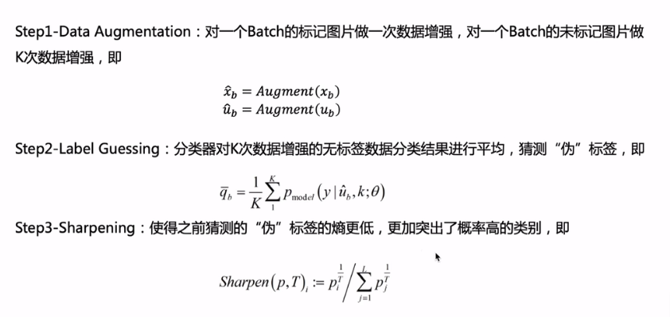
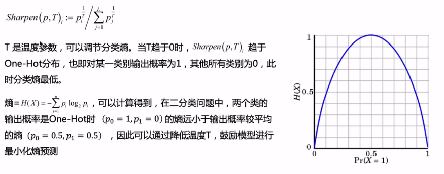
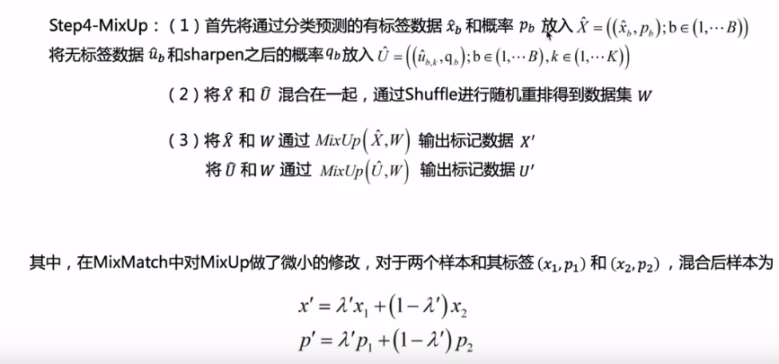
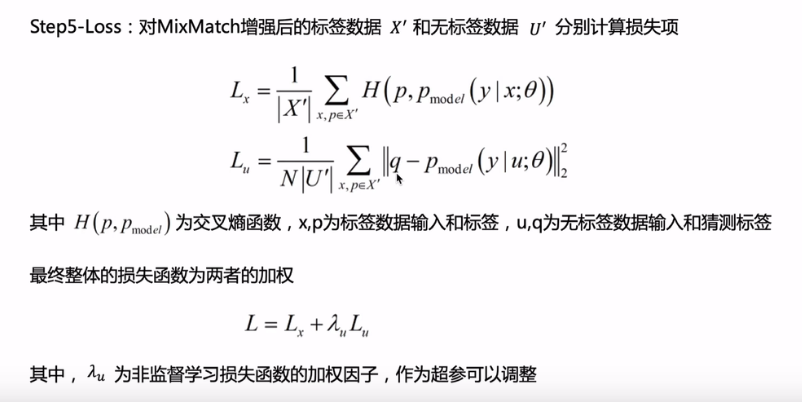

# 2019-MixMatch

> 论文题目：MixMatch: A Holistic Approach to Semi-Supervised Learning
>
> 论文链接：[https://arxiv.org/abs/1905.02249](https://arxiv.org/abs/1905.02249)
>
> 论文代码：[https://github.com/google-research/mixmatch](https://github.com/google-research/mixmatch)
>
> 发表时间：2019年5月
>
> 引用：Berthelot D, Carlini N, Goodfellow I, et al. Mixmatch: A holistic approach to semi-supervised learning[J]. Advances in neural information processing systems, 2019, 32.
>
> 引用数：1687

## 1. 简介

实验表明，MixMatch 在许多数据集和标注数据上获得了 STOA 结果，展现出巨大优势。例如，在具有 250 个标签（相当于每类25个样本）的 CIFAR-10 数据集上，MixMatch 将错误率降低了 71%（从 38％ 降至 11％），在 STL-10 上错误率也降低了 2 倍。

## 2. 网络

## 3. 代码

