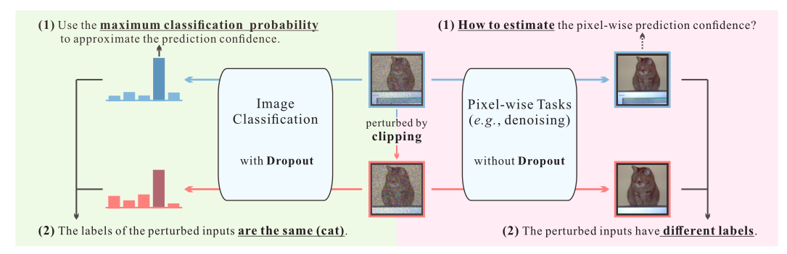
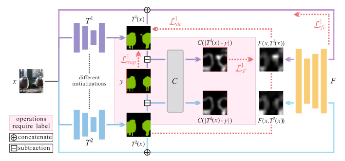

# 2020-GCT ECCV

> 论文题目：Guided Collaborative Training for Pixel-wise Semi-Supervised Learning
>
> 论文链接：[https://arxiv.org/abs/2008.05258](https://arxiv.org/abs/2008.05258)
>
> 论文代码：[https://github.com/ZHKKKe/PixelSSL](https://github.com/ZHKKKe/PixelSSL)
>
> 发表时间：2020年8月
>
> 引用：Ke Z, Qiu D, Li K, et al. Guided collaborative training for pixel-wise semi-supervised learning[C]//European conference on computer vision. Springer, Cham, 2020: 429-445.
>
> 引用数：80

## 1. 简介

### 1.1 摘要

我们研究了半监督学习（SSL）对不同像素级任务的推广。虽然SSL方法在图像分类中取得了令人印象深刻的效果，但由于其对密集输出的要求，将其应用于像素级任务的性能并不理想。此外，现有的像素级SSL方法仅适用于某些任务，因为它们通常需要使用特定于任务的属性。在本文中，我们提出了一个新的SSL框架，命名为引导协作训练（GCT），用于像素级任务，主要有两个技术贡献。首先，GCT通过一种新型的缺陷检测器来解决密集输出所引起的问题。第二，GCT中的模块通过两个新提出的独立于任务特定属性的约束从未标记数据中协作学习。因此，GCT可以应用于广泛的像素级任务，而无需结构调整。我们在四个具有挑战性的视觉任务上进行了大量的实验，包括语义分割、真实图像去噪、人像抠图和夜间图像增强，实验结果表明GCT的性能大大优于现有的SSL方法。

### 1.2 两个问题

1. `密集输出需要的像素级预测置信度是难以估计的`。像素级任务可以是像素级分类（如语义分割和阴影检测）或像素级回归（如图像去噪和抠图）。虽然在像素级分类中可以用最大分类概率来表示预测置信度，但在像素级回归中却不可用。
2. 为SSL设计的`现有扰动不适合密集输出`。在像素级的任务中，输入中的强扰动（例如，Mean Teacher）既会改变输入图像，也会改变真值标签。因此，来自同一原始图像的不同扰动，就会导致不同的标签，这在SSL中是不好的。此外，通过Dropout的扰动在大多数像素级任务是不起作用的。尽管Dual Student提出通过不同的模型初始化来产生扰动，其训练策略只能用于图像分类。

### 1.3 解决办法

为了解决上述两个由密集输出引起的问题，我们提出了一个新的SSL框架，命名为Guided Collaborative Training（GCT），用于像素级任务。它包括三个模块：`特定任务的两个模型（任务模型）`和`一个新的缺陷检测器`。

GCT克服了这两个问题：

1. 通过缺陷检测器的输出（即缺陷概率图）近似像素级预测置信度；

2. 将双学生任务中使用的扰动扩展到像素级任务。

   由于不同的模型初始化会导致对同一输入的预测不一致，因此我们可以在预测中集成可靠的像素（ensemble the reliable pixels），即缺陷概率较低的像素。此外，对缺陷概率图的最小化应有助于纠正预测中不可靠的像素。

   基于这些思想，我们引入了两个SSL约束，一个是任务模型之间的动态一致性约束，一个是缺陷检测器和每个任务模型之间的缺陷修正约束，这样就可以使GCT中的模块在缺陷概率图的指导下，而不是在任务特定属性的指导下，协同学习未标记的数据。因此，GCT可以应用于不同的像素级任务，只需替换任务模型而无需进行结构调整。

## 2. 网络

### 2.1 整体架构

### 2.2

## 3. 代码

