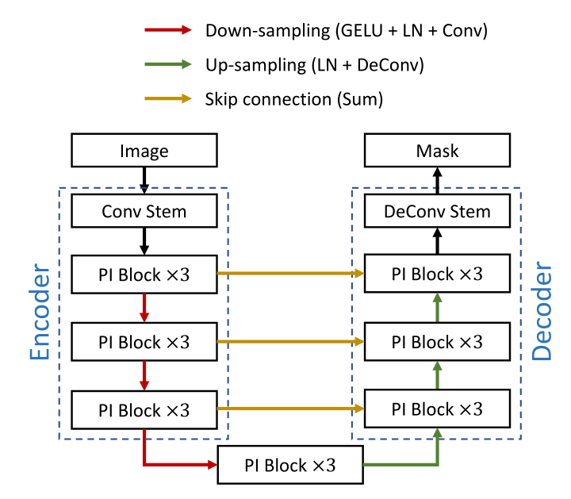
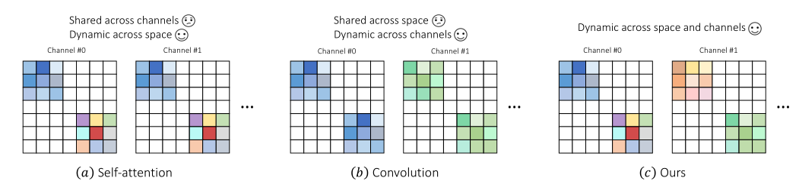
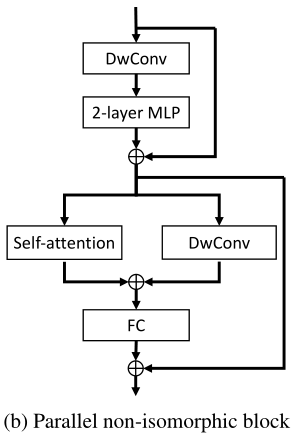
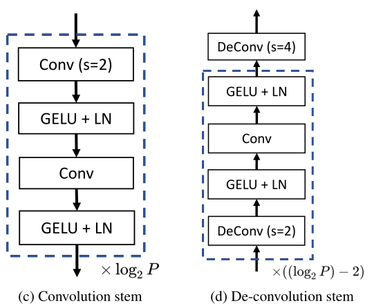

# 2022-Unet2022

> 论文题目：UNet-2022: Exploring Dynamics in Non-isomorphic Architecture
>
> 论文链接：[https://arxiv.org/abs/2210.15566](https://arxiv.org/abs/2210.15566)
>
> 论文代码：[https://github.com/282857341/UNet-2022](https://github.com/282857341/UNet-2022)
>
> 单位：厦门大学, 香港大学
>
> 发表时间：2022年10月

## 1. 简介

### 1.1 摘要

最近的医学图像分割模型大多是混合的，将自关注和卷积层集成到非同构结构中。然而，这些方法的一个潜在缺点是，它们无法直观地解释为什么这种混合组合方式是有益的，这使得后续工作很难在其基础上进行改进。为了解决这个问题，我们首先分析了自我关注和卷积的权重分配机制之间的差异。基于这一分析，我们提出构造一个并行非同构块，该块利用简单并行化的自关注和卷积的优点。我们将得到的U形分割模型命名为UNet-2022。

### 1.2 贡献

* 我们提供了一个直观的解释，说明为什么自我关注和卷积可以相互补充。核心区别在于权重分配机制的动态特性。自我关注强调了空间动态的重要性，但忽略了通道动态。相反，卷积将动态权重分配给不同的通道，而不是空间位置。
* 我们提出了一种新的权重分配机制，将动态权重引入到空间和信道维度。权重分配机制的实现非常简单，包括并行独立的自我关注和卷积模块。生成的非同构块将动态权重分配给不同的空间位置和通道，使其能够捕获特征图中出现的复杂模式

## 2. 网络

### 2.1 整体网络架构

模型整体和Unet结构没啥差别。就是把卷积块进行了替换。

### 2.2 权重策略

最近的医学图像分割模型大多是混合的，将自关注和卷积层集成到非同构结构中。然而，这些方法的一个潜在缺点是，它们无法直观地解释为什么这种混合组合方式是有益的，这使得后续工作很难在其基础上进行改进。为了解决这个问题，我们首先分析了自我关注和卷积的权重分配机制之间的差异。

> (a) 自注意力
>
> (b) 卷积
>
> (c) Unet2022的模块
>
> 不同颜色表示不同权重
>
> 在自注意力，权重矩阵在空间上是动态的，但在不同的通道上是共享的。相反，卷积的权重矩阵在空间上共享，但在信道上不同。我们的模块通过将动态权重分配给不同的位置和通道，集成了自我关注和卷积的优点。

### 2.3 Parallel non-isomorphic block

### 2.4 Convolution stem 

### 2.5 实验

## 3. 代码

