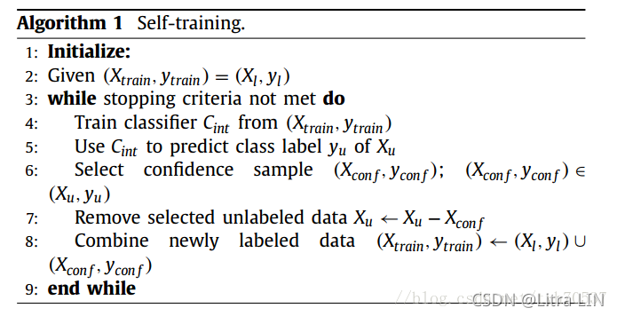
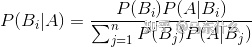
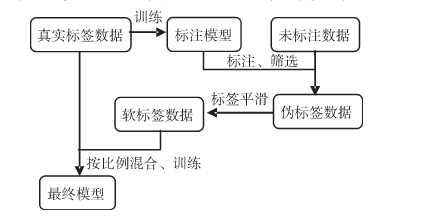
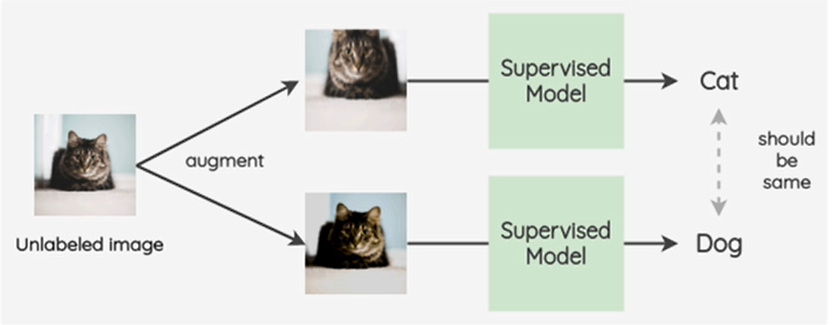

## 半监督学习

> 半监督学习的研究的历史可以追溯到**20世纪70年代**，这一时期，出现了自训练(Self-Training)、直推学习(Transductive Learning)、生成式模型(Generative Model)等学习方法。
>
> 2009年Chapalle编著的[Semi-Supervised Learning](http://www.acad.bg/ebook/ml/MITPress- SemiSupervised Learning.pdf)，就对其定义和原理做了详细介绍。

## 1. 传统的半监督学习

### 1. 自训练(伪标签)

**self-training，即自我训练，也称之为伪标签技术，初代半监督思想的经典代表**，最早可以追溯到1965.self-training相比于其他半监督学习方法的优势在于简单以及不需要任何假设。

1. 将初始化的有标签数据作为初始的训练集$(X_{train},y_{train})=(X_l，y_l)$，根据该训练集训练得到一个初始分类器$C_{int}$
2. 利用$C_{int}$对无标签数据集$X_u$进行分类，选出最有把握的样本$X_{conf},y_{conf}$（可以设定阈值来选择）
3. 从$X_u$中去掉$X_{conf},y_{conf}$
4. 将$X_{conf},y_{conf}$加入到有标签数据集中,$(Xtrain,ytrain)←(X_l,y_l)∪(X_{conf},y_{conf})$
5. 根据新的训练集训练新的分类器，重复步骤2到5直到满足停止条件（例如所有无标签样本都被标记完了）
   最后得到的分类器就是最终的分类器。

### 1.2 协同学习 (co-training)

和自我学习一样，协同学习的目的也是为了用现有的有标签的数据去标记其他数据。具体步骤如下：假设现在有数据集，每组数据有2个特征(feature): x1 和 x2。我们把其中有标签的那部分数据集称为L （表示为[x1,x2,y]），没有标签的数据集称为U (表示为[x1,x2])。

初始化数据，把L 分为L1 ([x1,y]) 和L2 ([x2,y])。这里注意，L 是一个数据集，里面包涵了很多数据，我就顺便提醒一下。
重复：a) 分别用L1和L2训练出一个模型 F1和F2
b) 分别用模型F1和F2去预测U (给U打标签)，同样这里也是只选出最有把握的一些结果。

c) 把F1预测的结果放入L2，把F2预测的结果放入L1 (交叉放置)

d) 更新L 和 U

直到数据集不发生变化 (和自我学习一样)

### 1.3 生成式半监督模型

判别式模型（Discriminative Model）是直接对条件概率p(y|x;θ)建模，我们目前所熟知的逻辑回归、gbdt、神经网络等主流算法都属于判别式模型，这里x代表数据，θ代表模型的参数，y代表标签。

生成式模型（Generative Model）则会对x和y的联合分布p(x,y)建模，然后通过贝叶斯公式来求得p(yi|x)，最后选取p(yi|x)最大时对应的yi，贝叶斯公式如下：

**朴素贝叶斯、混合高斯、隐马尔可夫、贝叶斯网络等相对冷门的这些算法都属于生成式模型**。

而生成式半监督模型本质上还是一个生成式模型，即先对x和y的联合分布p(x,y)建模，然后通过贝叶斯公式来求得p(yi|x)，然后选取p(yi|x)最大时对应的yi，无论是生成式模型还是生成式半监督模型重要的地方都在于 p(x,y)，即联合分布，常由人工主观来确定，例如我们假设数据符合混合高斯分布则会使用混合高斯的联合分布概率密度作为待求解生成式模型方程然后带入数据求解，因此这类方法往往都需要一定的的较强的领域先验知识来假设数据服从的潜在的分布是哪一种分布，错误的分布假设只会带来更加错误的结果；

简而言之，基于生成式模 型的方法假设所有数据均由相同的生成式模型产生，借助模型参数将未标记数据与学习目标联系起来，通常利用 EM 算法根据极大似然来估计模型参数**，典型的例子就是半监督版的高斯混合模型。**

## 2. 三个假设

半监督学习依赖于模型的假设，当模型假设正确时，无类标签的样例能够帮助改进学习性能。三个假设如下：

1. **平滑假设（Smoothness Assumption）**

   位于稠密数据区域的两个距离很近的样例的类标签相似，也就是说，当两个样例被稠密数据区域中的边连接时，它们在很大的概率下有相同的类标签；相反地，当两个样例被稀疏数据区域分开时，它们的类标签趋于不同． 

2. **聚类假设（Cluster Assumption）**

   当两个样例位于同一聚类簇时，它们在很大的概率下有相同的类标签．这个假设的等价定义为低密度分离假设（Low Sensity Separation Assumption），即分类决策边界应该穿过稀疏数据区域，而避免将稠密数 据区域的样例分到决策边界两侧。

3. **流形假设（Manifold Assumption）**

   将高维数据嵌入到低维流形中，当两个样例位于低维流形中的一个小局部邻域内时，它们具有相似的类标签。

## 3. 深度学习下的半监督学习方法

 **已有的半监督深度学习算法可分为三类：无监督特征学习类，正则化约束类和生成式对抗网络类。**

* 无监督特征学习类算法通常利用所有样本（包含标记样本和无标记样本）学习出样本的隐特征或隐含变量 表 示，在此基础上利用有监督分类器对无标记样本所对应的隐特征进行分类，从而间接地对无标记样本进行分类。
* 正则化约束类算法通常是在有监督神经网络的输出层或者隐含层的目标函数中加入体现样本分布，特性的正则化项，用以在训练中引入无标记样本。
* 生成式对抗网络GAN中，通过让生成器和判别器相互竞争达到平衡状态来无监督地训练网络．由于 GAN 在生成模拟真实样本上的成功表现，一个很自然的想法就是在标记样本较少的情况下，能否利用GAN所学到的样本内容分布和强大的竞争学习能力来提高网络分类性能。

### 3.1 伪标签

* 首先,在人工标注的数据集上训练模型,挑选精度最高的模型作为标注生成模型,通过`标注生成模型为大量未标注数据生成伪标签`;
* 其次,通过设置不同置信度阈值过滤伪标签数据带来的噪声,并对所有伪标签数据进行标签平滑,生成软标签,减少伪标签中错误的标注数据对网络训练的影响;
* 最后,将人工标注数据与软标签数据以一定比例进行混合训练,提高模型的鲁棒性,增强模型对新数据的泛化能力。

方法如下：

* self-training
* co-training
* tri-training

### 3.2 一致性正则化

**一致性正则要求一个模型对相似的输入有相似的输出，即给输入数据注入噪声，模型的输出应该不变，模型是鲁棒的。**

像下面这张图，对一张图片进行两次图片增强(加入噪音),通过模型进行结果的预测，应该是相似。

常见论文如下：

* Temporal Ensembling for Semi-Supervised Learning

  论文链接：[https://arxiv.org/abs/1610.02242](https://arxiv.org/abs/1610.02242)

  论文代码：[https://github.com/s-laine/tempens](https://github.com/s-laine/tempens)

  发表时间：2016年10月

* Mean-Teacher

  论文链接：[https://arxiv.org/abs/1703.01780](https://arxiv.org/abs/1703.01780)

  论文代码：[https://github.com/CuriousAI/mean-teacher](https://github.com/CuriousAI/mean-teacher)

  发表时间：2017年3月

### 3.3 基于半监督对抗学习

### 3.4 混合模型

一致性正则化+伪标签的方式的模型

