# 半监督医学图像分割汇总

## 1. 简介

### 1.1 基本概念

* **Zore-shot learning**，零样本学习。支持集为训练集，其为带标签的seen classes，查询集为测试集即unseen classes，零样本学习将识别与每个没见过的类在语义上与见过的类之间的相关知识。也就是，如果我们知道马长什么样子，知道斑马长得像马且有条纹，那么我们就算没见过也可以识别出斑马。
* **One-shot learning**，一样本学习。即当新未见过的类别只有一个的样本时，希望模型可以通过已经学习到的旧类别去预测新类别。此时的meta-learing就不是想传统监督学习那样，为了总结某个类的分布中存在的共享信息和模式，而是试图学习存在于任务分布上的规律（也就是怎么去学习）。
* **Few-shot learning**，少样本学习。机器学习模型在学习了一定类别的大量数据后，新的未见类是少量的样本就能快速学习。
* **C-way K-shot 问题**。训练集中有很多类别，选出C个类别，每个类别选出K个样本，作为支持集，再从C个类别中抽取剩余的batch作为测试集。

可以参考值这个视频

https://www.bilibili.com/video/BV1V44y1r7cx

### 1.2 什么叫小样本(Few shot)

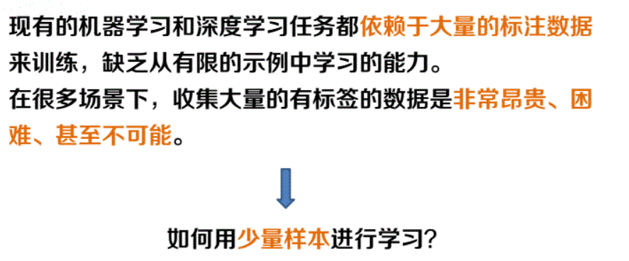

因为这个需求，所以诞生了小样本学习这个领域。

小样本学习的意思就是，人有仅靠少量数据，就可区分图片的能力，现在让模型也拥有这样子的模型

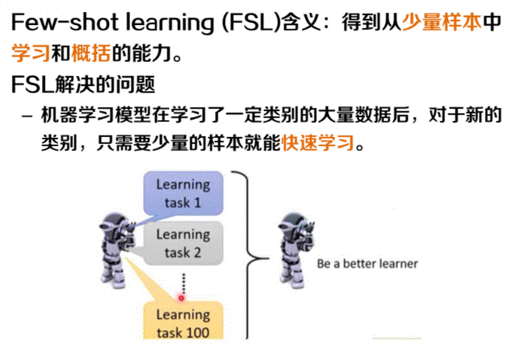

## 2. 如何解决小样本问题

* 基于模型微调:首先在含有大量数据的源数据集上训练一个分类模型，然后在含有少量数据的目标数据集上对模型进行微调;
* 基于数据增强:利用辅助数据集或者辅助信息增强目标数据集中样本的特征或扩充目标数据集--基于无标签数据、基于数据合成和基于特征增强;
* 基于迁移学习:将已经学会的知识迁移到一个新领域
  * 基于度量学习
  * 基于元学习
  * 基于图神经网络;

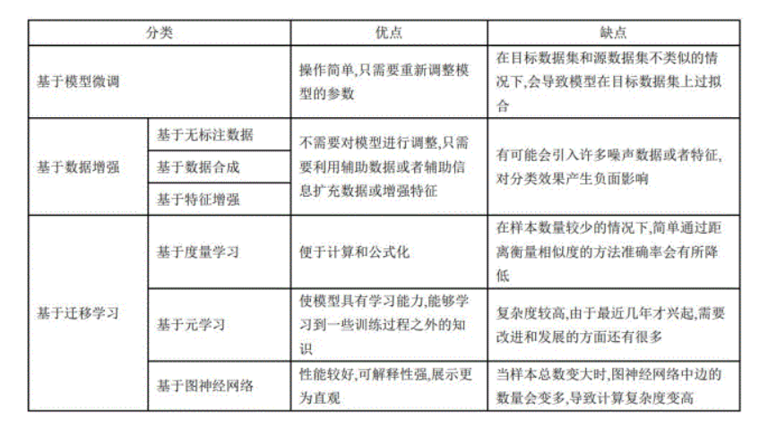

这里重点讲解 基于迁移学习的内容

### 2.1 元学习(一种架构)

#### 1) 概念

> 元学习（Meta-Learing），又称“学会学习“（Learning to learn）, 即利用以往的知识经验来指导新任务的学习，使网络具备学会学习的能力，是解决小样本问题（Few-shot Learning）常用的方法之一，

**元学习中的”元“是什么意思？**

元学习的本质是增加学习器在多任务的泛化能力，元学习对于任务和数据都需要采样，因此学习到的 F(x) 可以在未出现的任务中迅速（依赖很少的样本）建立起mapping。因此”元“体现在网络对于每个任务的学习，通过不断的适应每个具体任务，使网络具备了一种抽象的学习能力。

**元学习中的训练和测试？**

Meta-learning中为了区别概念，将训练过程定义为”Meta-training“、测试过程定义为”Meta-testing“, 如下图所示：

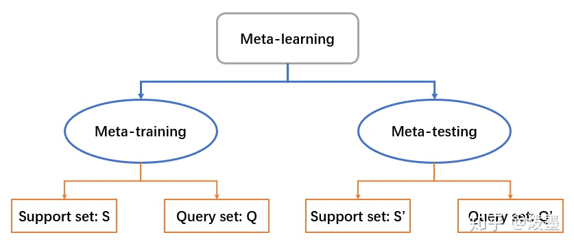

如上图，区别于一般神经网络端到端的训练方式，元学习的训练过程和测试过程各需要两类
数据集（Support/Query set），其构建方式为：

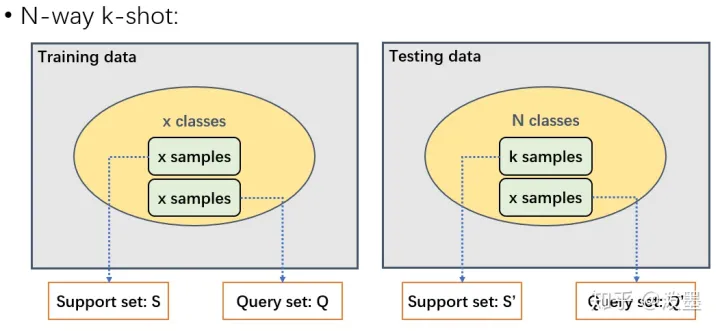

如上图所示的小样本分类任务属于” N-way k-shot“问题，**其中，N代表选择的Testing data**
**中样本的种类，k代表选择的K类Testing data中每类样本的数量，一般来说N小于Testing**
**data的总类别数。**

* 如何构建S’和Q‘?
  我们从Testing data中随机选出 N 个类。然后，再从这 N 个类中按照类别依次随机选出 k+x
  个样本（x 代表可以选任意个），其中的 k 个样本将被用作 Support set S'，另外的 x 个样
  本将被用作 Query set Q'。S和Q的构建同理，不同的是从Training data中选择的样本类别和
  每类样本数量均不做约束。
* 如何训练？
  Meta-learning 通常采用一种被称为 Episodic Training 的方法来进行训练。

**元学习和迁移学习的区别和联系？**

从目标上看，元学习和迁移学习的本质都是增加学习器在多任务的范化能力，但元学习更偏重于任务和数据的双重采样，即任务和数据一样是需要采样的，具体来说对于一个10分类任务，元学习通过可能只会建立起一个5分类器，每个训练的episode都可以看成是一个子任务，而学习到的F(x)可以帮助在未见过的任务里迅速建立mapping。而迁移学习更多是指从一个任务到其它任务的能力迁移，不太强调任务空间的概念。

#### 2) 解决方案

**元学习只是一种架构，具体的解决方法如下**

* 基于优化的方法的元学习
* 基于度量的方法的元学习
* 基于网络结构的元学习

参考资料

https://blog.csdn.net/weixin_39584888/article/details/122506902

### 2.2 度量学习(一种方法)

#### 1) 概念

> * 那么什么是度量学习呢？**度量学习(Metric Learning) 是人脸识别中常用的传统机器学习方法，由Eric Xing在NIPS 2002提出**，可以分为两种：一种是通过线性变换的度量学习，另一种是通过非线性变化的度量。
> * 其基本原理是根据不同的任务来自主学习出针对某个特定任务的度量距离函数。度量学习（Metric Learning）是一种空间映射的方法，其能够学习到一种特征（Embedding）空间，在此空间中，所有的数据都被转换成一个特征向量，并且相似样本的特征向量之间距离小，不相似样本的特征向量之间距离大，从而对数据进行区分。
> * 度量学习应用在很多领域中，比如图像检索，人脸识别，目标跟踪等等。后来度量学习又被迁移至文本分类领域，尤其是针对高维数据的文本处理，度量学习有很好的分类效果。

度量学习解决的问题不一定是few shot的问题。也可以说其他方面的问题，比如人脸识别，目标跟踪等等。

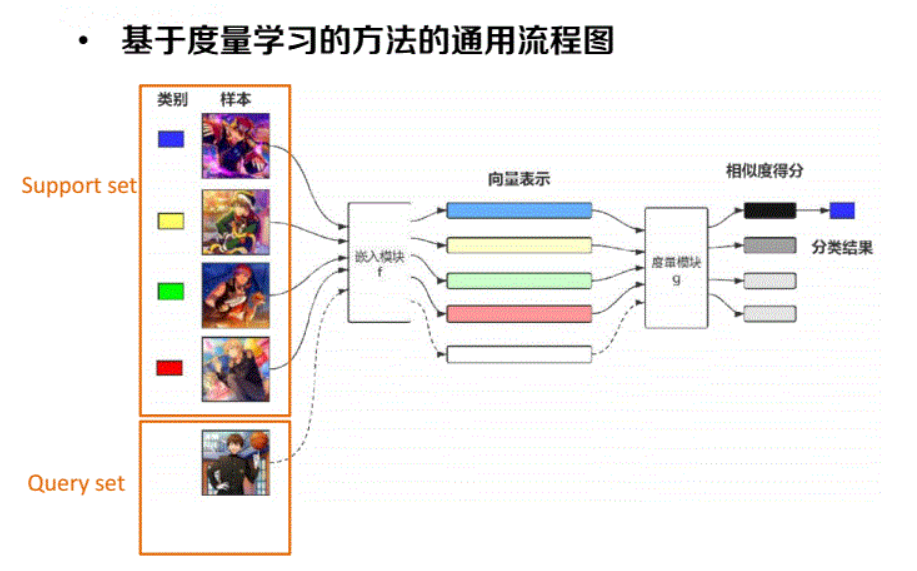

#### 2) 基于度量的元学习方法

> 重点讲一下这个
>
> 参考资料：https://blog.csdn.net/weixin_39584888/article/details/122506902

接下来整理一些比较有代表性的度量学习文章：

**Siamese Neural Networks(孪生网络)**

孪生神经网络是一种相似性度量模型，当类别数多但每个类别的样本数量少的情况下可用于类别的识别。主要思想是通过嵌入函数将输入映射到目标空间，使用简单的距离函数进行相似度计算，然后在训练阶段最小化一对相同类别样本pair的损失同时最大化一对不同类别样本pair的损失。

模型结果如上图，先用cnn 提取特征Embedding，然后计算距离最后预测概率这两个输入是否是same class，同类为1，不同为0，损失计算是交叉熵。之所以叫孪生是因为两个孪生神经网络共享一套参数和权重（即一个cnn来抽特征）。

然后看看test阶段如何做的，比如对于one-shot来说，由于训练集中每个类别只有一个样本，所以测试集中的每张图像和训练集中的每个样本都组成一个样本对，依次输入到孪生神经网络中，得到每对样本的距离，选取距离最小的训练样本的标签作为测试样本的类别，从而完成分类。
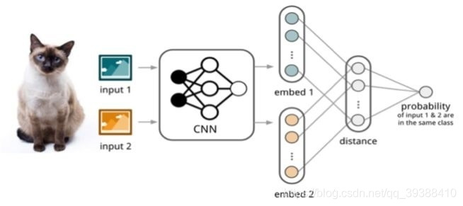

**Match Network**

也是度量学习，与上面那个不一样的地方在于其从一对以一变成了一对多的关系，如上图的输入变成了多个带类别的样本和不带类别的样本。所以该网络的目的是可以将带标签的小样本数据和不带标签的样本映射到对应的标签上。使用的网络同样是CNN，然后新样本会和每一个向量都计算相似度最后得到得分。

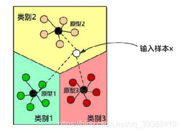

**Prototypical Networks**

同样的还有原型网络（Prototypical Networks），类似k-means，作者认为每个类别在向量空间中都存在一个原型，即类别的中心点，所以对于映射后的样本求均值得到某类别的原型，训练loss使同类样本接近，而不同类样本远离。但是因为样本量太少会导致分类边界偏差，所有可以使用半监督的想法做出一些改进：

* 所有的无标签数据都属于带标签的数据所属的类别，将无标签数据和带标签数据一起计算新的原型。
* 无标签数据要么属于带标签数据所属的类别，要么属于一个另外的类——干扰类(distractor class)。干扰类开始以原点(0,0)作为原型，模型学习的是干扰类的半径。

* 无标签数据要么属于已知的类别，要么被掩盖(masked)。

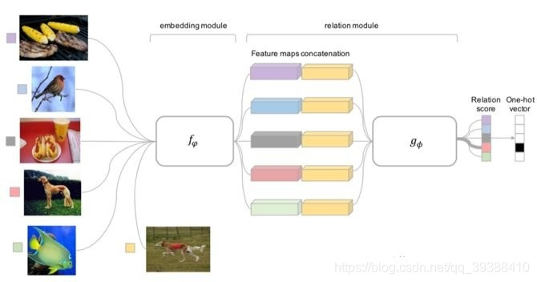

总结一下。。。。。。。

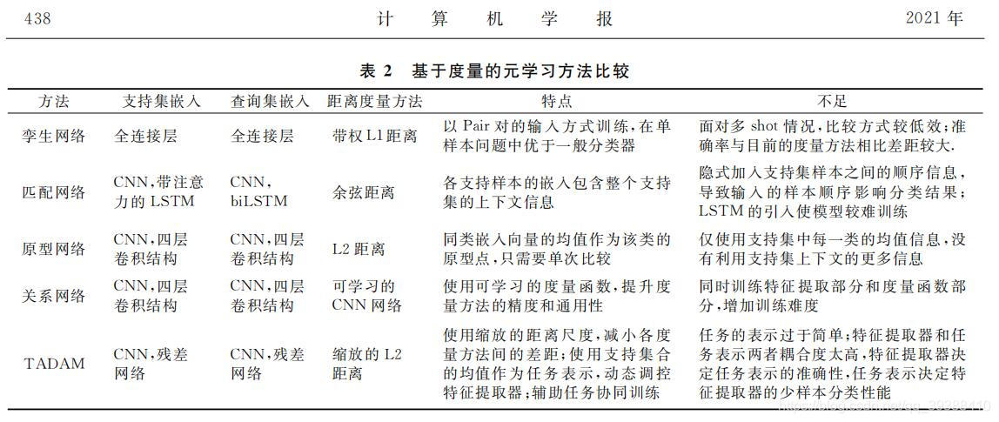

### 2.3 半监督学习

> 小样本学习技术主要研究如何利用少量有监督样本来解决机器学习任务。经常被提起的还有半监督学习，其主要区别在于，半监督学习是解决小样本学习问题的重要手段之一。

在许多ML的实际应用中，很容易找到海量的无类标签的样例，但需要使用特殊设备或经过昂贵且用时非常长的实验过程进行人工标记才能得到有类标签的样本，由此产生了极少量的有类标签的样本和过剩的无类标签的样例。因此，人们尝试将大量的无类标签的样例加入到有限的有类标签的样本中一起训练来进行学习，期望能对学习性能起到改进的作用，由此产生了SSL，
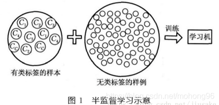

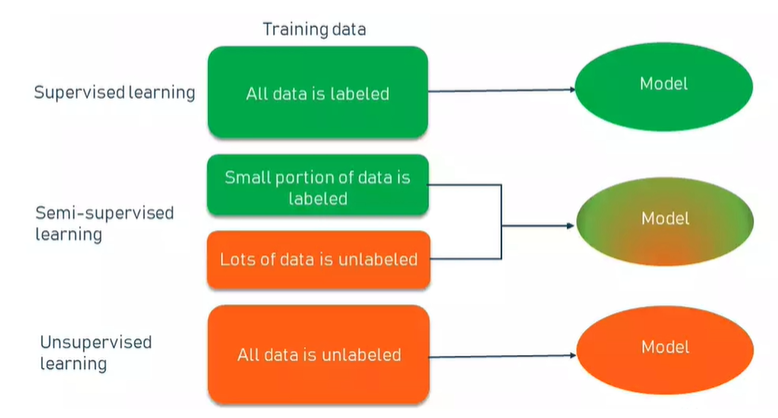

## 3. 半监督医学图像分割

### 3.1 医学图像的问题或需求

**准确、鲁棒地从医学图像中分割出器官或病变在许多临床应用中起着至关重要的作用，如诊断和治疗计划**。随着标注数据的大量增加，深度学习在图像分割方面获得了巨大地成功。然而，对于医学图像来说，标注数据的获取通常是昂贵的，因为生成准确的注释需要专业知识和时间，特别是在三维图像中。为了降低标记成本，近年来人们提出了许多方法来开发一种高性能的医学图像分割模型，以减少标记数据。例如，将用户交互与深度神经网络相结合，交互式地进行图像分割，可以减少标记的工作量。自监督学习方法是利用无标签数据，以监督的方式训练模型，学习基础知识然后进行知识迁移。半监督学习框架直接从有限地带标签数据和大量的未带标签数据中学习，得到高质量的分割结果。弱监督学习方法从边框、涂鸦或图像级标签中学习图像分割，而不是使用像素级标注，这减少了标注的负担。但是，弱监督学习和自监督学习在医学图像分割任务上性能依旧受限，尤其是在三维医学图像的分割上。除此之外，**少量标注数据和大量未标注数据更加符合实际临床场景。**

### 3.2 分类

* **带伪标签的半监督学习，将未标记的图像通过分割模型进行预测和伪标记，然后作为新的示例进行进一步的训练。**
* **无监督正则化的半监督学习，将无标签的图像和有标签的数据联合起来训练一个无监督正则化的分割模型。本节主要包括一致性学习、协同训练、对抗学习、熵最小化。**
* **具有知识先验的半监督学习，利用未标记的图像使模型具有目标的形状、位置等知识先验，提高医学图像分割的表示能力**。

## 5. 常见模型

需要看的

https://blog.csdn.net/weixin_36080653/article/details/112658404

## 6. 代码

**一个相当不错的案例**

[HiLab-git/SSL4MIS: Semi Supervised Learning for Medical Image Segmentation, a collection of literature reviews and code implementations. (github.com)](https://github.com/HiLab-git/SSL4MIS)

> 近年来，CNN在医学图像分割领域取得了统治级的地位，nnUNet及其各种魔改版本几乎霸占了各大比赛的leaderboard，但大多医学图像分割任务一直因为标注数量太少而饱受诟病。
>
> 目前大多研究集中于调整网络结构等方面（加各种attention，各种feature fusion），希望在有限的数据上拟合出更加性能强悍的模型，而较少的**去利用未标注数据来训练更加鲁棒和泛化性更好的模型**（在临床场景下海量的未标注原始数据被保留在数据中心中，医生没有时间和精力对其大规模标注，只有少量数据会被标注用于临床或算法研究）。
>
> **如何缓解标注图像数量太少，未标注数量太多和有效利用未标注的原始数据等问题，已然成为了医学图像分割发展的主要矛盾。**
>
> 近两年来，尤其是今年，这个问题被越来越多的研究者所注意，据不完全统计MICCAI2020有十来篇文章致力于解决这样的问题。
>
> 在阅读这些文章的过程中发现：不同的文章有不同的实验设置，不同的数据集，对比了不同的方法，得出了不同的结论，因此建立基准数据集和算法库方便大家快速开发和验证算法，避免重复造轮子和浪费大量的时间去复现已有算法变得越发重要。
>
> 针对这样一些问题，我们尝试基于一些医学图像比赛的公开数据集搭建一个平台方便大家去开展自己的研究。目前我们基于UNet （Efficient-UNet）和3D-UNet等常用网络结构，ACDC，BraTS等开源数据集

[HiLab-git/SSL4MIS: Semi Supervised Learning for Medical Image Segmentation, a collection of literature reviews and code implementations. (github.com)](https://github.com/HiLab-git/SSL4MIS)

[医学图像半监督分割Baselines. - 知乎 (zhihu.com)](https://zhuanlan.zhihu.com/p/277425371)