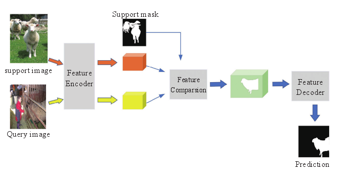
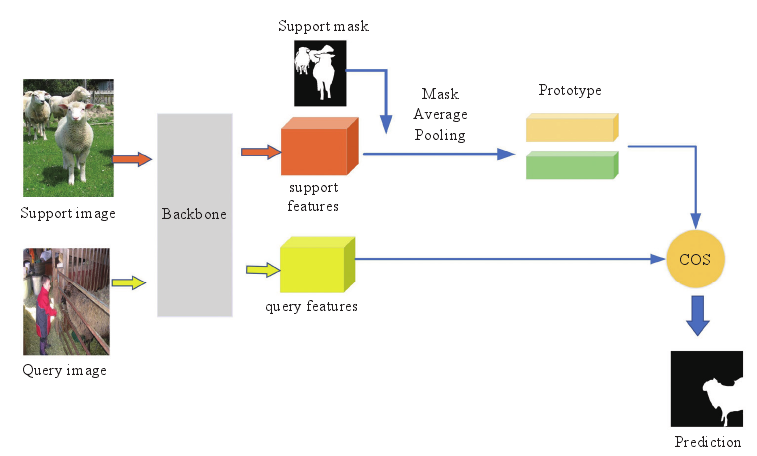

# 半监督语义分割

## 1. 小样本语义分割

### 1.1 基于度量的元学习小样本语义分割

根据度量学习的参数是否可以更新，基于度量的元学习小样本语义分割分为两种

#### 1) 基于参数结构的小样本分割

#### 2) 基于原型结构的小样本分割模型

### 1.2 弱监督语义分割

弱监督学习是指，利用已知数据和其对应的弱标签，如图像级别标签、边界框标注等，训练一个模型将数据映射到一组更强的标签的过程，此处标签的强弱即为标签蕴含信息量的多少。

在语义分割任务上，常见半监督分割方法解决的是数据标注数量问题,

而弱监督语义分割方法解决的是对于图像的精细的像素级标注造成的时间人力成本问题。

通过弱监督学习，可以大大减轻对像素级标签的高度依赖性。但弱监督学习仍然需要大量弱标签来训练模型，而小样本分割只需要极少的像素级标签，便可以完成得到良好的分割结果

### 1.3 半监督语义分割

有监督语义分割需要像素级别标记的数据，这些数据的获取是相当昂贵和费时的。半监督语义分割利用未标记的数据，从未标记和已标记的混合样本中学习最优分割模型，可以大大减少像素级别注释的工作，也可以保持相当高的准确性

## 2. 半监督语义分割

半监督学习的发展推动着 半监督语义分割的发展。 所以半监督语义分割的内容和 半监督学习差不多

### 2.1 自训练(伪标签)

### 2.2 基于一致性正则化的图像分割

### 2.3 基于半监督对抗学习的图像分割

> 2018年开始的
>
> **AdvSemiSeg是半监督语义分割领域最早的文章之一**。[[1802.07934\] Adversarial Learning for Semi-Supervised Semantic Segmentation (arxiv.org)](https://arxiv.org/abs/1802.07934)

