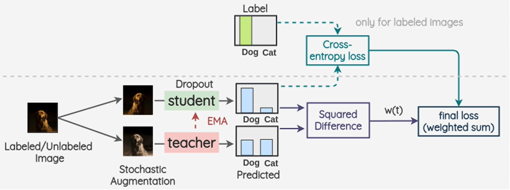

# 2017-Mean-Teacher NIPS

> 论文题目：Mean teachers are better role models: Weight-averaged consistency targets improve semi-supervised deep learning results
>
> 论文链接：[https://arxiv.org/abs/1703.01780](https://arxiv.org/abs/1703.01780)
>
> 论文代码：[https://github.com/CuriousAI/mean-teacher](https://github.com/CuriousAI/mean-teacher)
>
> 发表时间：2017年3月
>
> 引用：Tarvainen A, Valpola H. Mean teachers are better role models: Weight-averaged consistency targets improve semi-supervised deep learning results[J]. Advances in neural information processing systems, 2017, 30.
>
> 引用数：2644

## 1. 简介

Mean-Teacher是对这篇论文[Temporal Ensembling for Semi-Supervised Learning](https://arxiv.org/abs/1610.02242)做的改进

## 2. 网络

## 3. 代码

