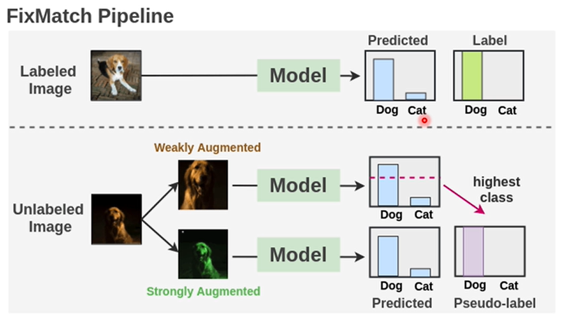
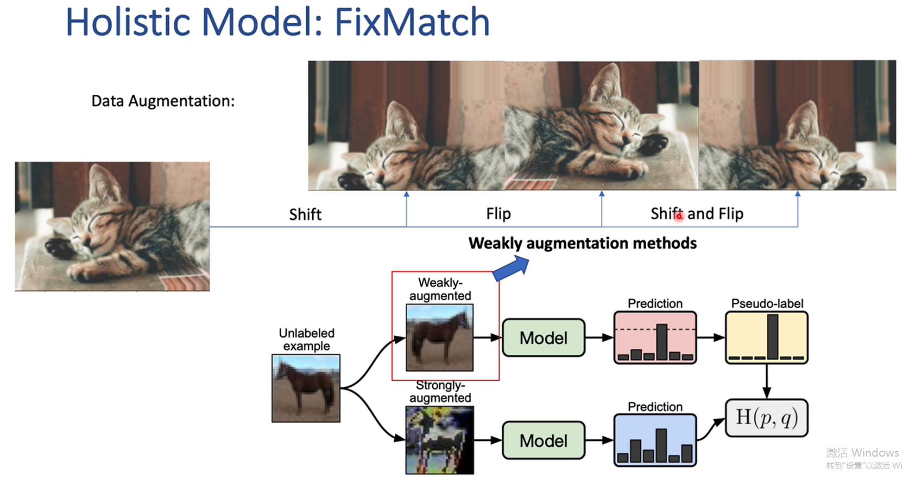

# 2020-FixMatch 

> 论文题目：FixMatch: Simplifying Semi-Supervised Learning with Consistency and Confidence
>
> 论文链接：[https://arxiv.org/abs/2001.07685](https://arxiv.org/abs/2001.07685)
>
> 论文代码：[https://github.com/google-research/fixmatch](https://github.com/google-research/fixmatch)

## 1. 简介

## 2. 网络

## 3. 代码

